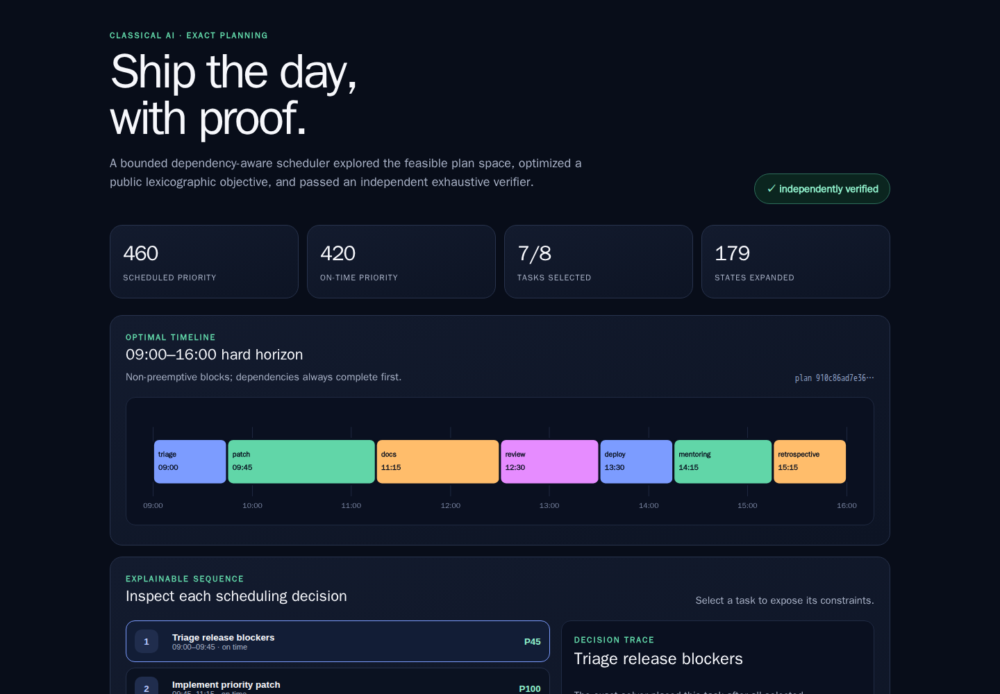
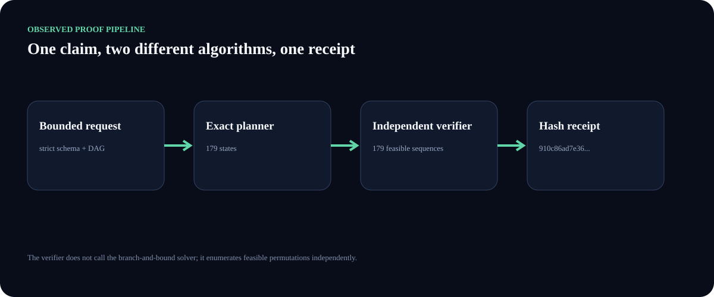
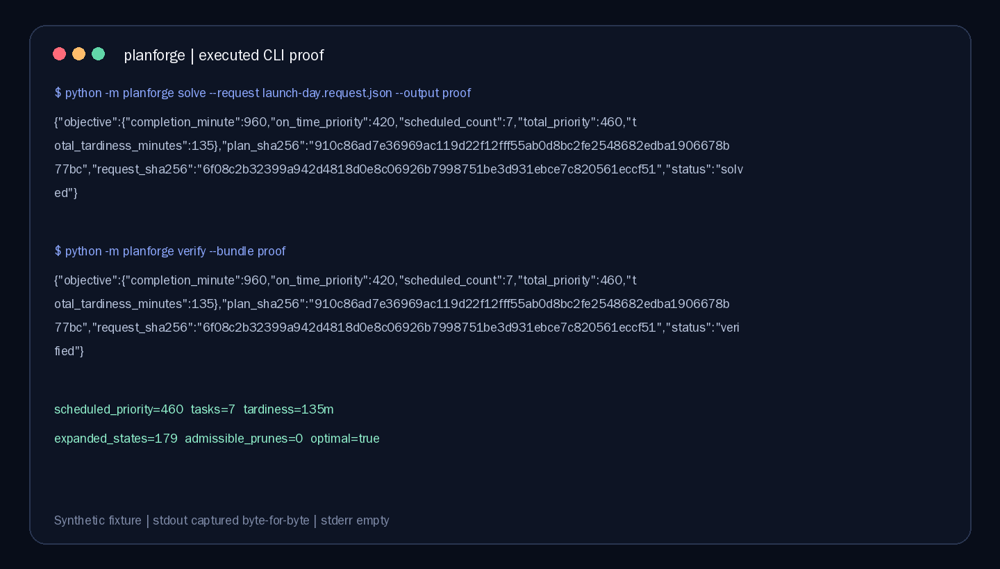
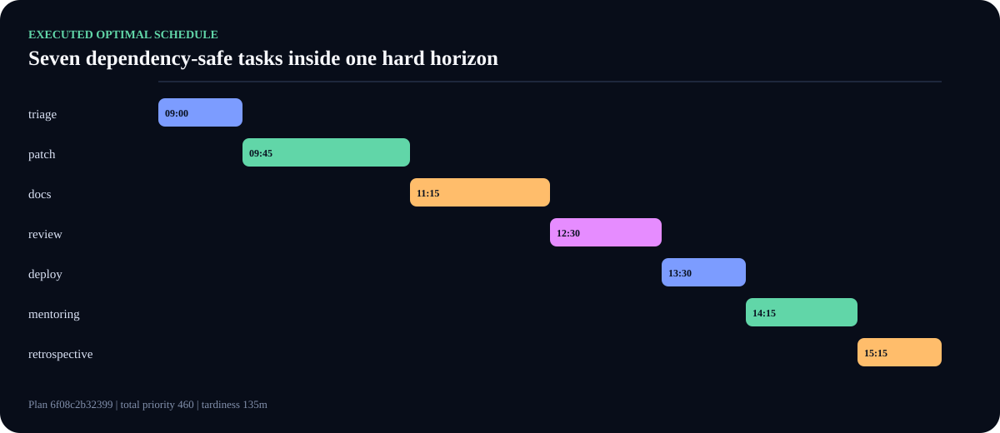
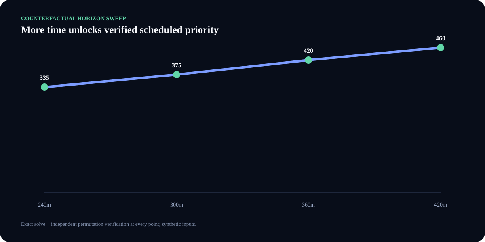
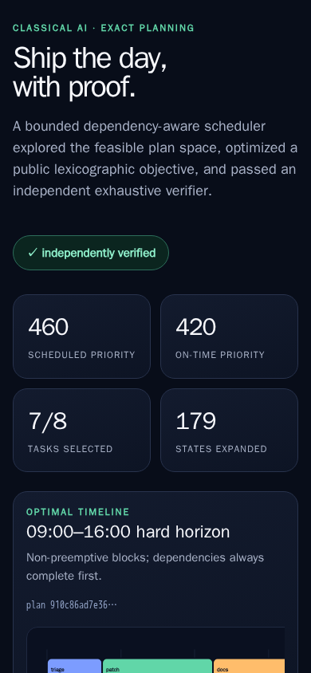
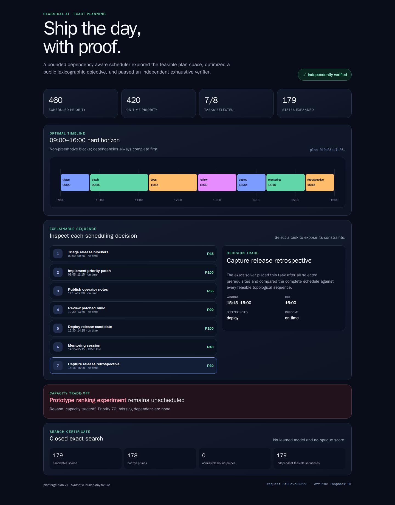

# PlanForge

PlanForge is a dependency-free classical-AI / operations-research lab that turns a bounded task DAG into an exact single-day schedule, a private proof bundle, and an independently recomputed verification receipt. It is deliberately not an LLM: every decision follows a public objective and every `optimal: true` claim is checked by a second algorithm.



This desktop screenshot is a real Chromium 151 capture of the implemented loopback HTTP server using the committed synthetic launch-day request. The visible schedule, hashes, task selection, search counts, and explanation panel come from executed code—not a design mockup.

## Why this project is technically interesting

A feasible schedule must fit one hard horizon, respect every dependency, honor each earliest start, and keep tasks non-preemptive. PlanForge then compares all feasible schedules lexicographically:

1. maximize scheduled priority;
2. maximize priority completed on time;
3. minimize total tardiness;
4. maximize scheduled task count;
5. minimize completion time;
6. break a complete tie by canonical task-id order.

The primary solver performs deterministic topological search with an admissible optimistic-priority bound. The verifier does **not** call that solver: it independently enumerates feasible permutations, reconstructs every block, recomputes the objective, and rejects any changed schedule, explanation, objective, request hash, or receipt.



For the committed eight-task fixture, the selected seven-task plan scores `460` total priority, `420` on-time priority, and `135` tardiness minutes. The solver expands `179` states and the independent implementation verifies `179` feasible sequences. The 420-minute horizon excludes the 120-minute experiment because every higher-priority dependency-safe combination is globally better under the published objective.

## Run it

Requirements: CPython 3.11–3.14. The runtime has zero third-party dependencies.

From a clean checkout:

```bash
python -m venv .venv
. .venv/bin/activate
python -m pip install .

planforge solve \
  --request examples/launch-day.request.json \
  --output proof

planforge verify --bundle proof
```

`solve` creates one no-clobber directory with exactly three mode-`0600` canonical JSON files: `request.json`, `plan.json`, and `verification.json`. `verify` re-runs the independent algorithm and prints one deterministic ASCII JSON summary. Existing output is never overwritten.



The displayed stdout was captured from the two commands above. Its full byte hashes and exit statuses are recorded in [the evidence manifest](docs/assets/planforge-evidence.json); stderr was empty.

Start the offline dashboard:

```bash
planforge serve \
  --request examples/launch-day.request.json \
  --host 127.0.0.1 \
  --port 8000
```

Then open `http://127.0.0.1:8000/`. Running `python app.py` is a source-checkout shortcut for the same synthetic fixture.

The server accepts only loopback bind addresses and loopback Host headers. It exposes three exact read-only routes (`/`, `/api/plan`, `/healthz`), rejects query strings and unsupported methods, emits no access log, and attaches a hash-bound Content Security Policy plus restrictive browser headers. HTML-unsafe task titles are escaped before rendering.

## What the solver actually produced



The Gantt is generated from [the exact canonical plan](docs/assets/planforge-plan.json). All prerequisites appear earlier than their consumers, and every block ends inside the 09:00–16:00 hard horizon.



This is not an illustrative trend line. Each 240/300/360/420-minute point is a separate exact solve followed by independent permutation verification; the machine-readable results live in the evidence manifest.

## Real interaction and responsive evidence


The GIF contains three actual 1440×1000 viewport screenshots after Playwright clicked different implemented task controls and observed the matching active detail panel. It is not a crop animation or conceptual storyboard.



The mobile image is explicitly Chromium mobile emulation at 390×844, not a physical-device screenshot. The timeline remains horizontally inspectable while metrics, proof state, and controls reflow to one column.



The full-page capture shows the complete executed result: objective, timeline, every selected task, the excluded capacity trade-off, and both search certificates.

## Input and proof contract

The exact [planning contract](docs/planning-contract.md) bounds requests to 64 KiB, 1–9 tasks, one 60–720 minute civil-day horizon, 15-minute slots, priority 1–100, canonical identifiers, trimmed control-free titles, known dependencies, and an acyclic graph. Unknown fields, duplicate JSON keys, booleans in integer positions, symlinks, changing files, and non-finite values fail closed.

Canonical request and plan bytes use sorted-key ASCII JSON with one trailing newline. SHA-256 binds request → plan → verification. Hashes prove exact byte relationships and replay; they do not prove that a person's duration or priority estimates are good.

## Verification and reproducible visuals

Run the complete dependency-free suite:

```bash
python -m unittest discover -s tests -v
```

Hosted gates currently prove:

- 32/32 behavioral, security, filesystem, CLI, solver, verifier, and real-loopback HTTP tests on Python 3.11, 3.12, 3.13, and 3.14;
- clean wheel and sdist construction with exact build-tool versions;
- execution of the installed wheel's console script outside the checkout;
- zero runtime dependencies in wheel metadata;
- CodeQL analysis;
- byte-for-byte regeneration of the complete 11-file evidence bundle in pinned Chromium 151.

The evidence renderer runs inside a platform-digest-pinned Playwright image with hash-locked wheels, no container network, a read-only root filesystem, a non-root user, dropped capabilities, and no new privileges. Initial adoption required two isolated captures to match byte-for-byte. Every later PR regenerates one complete candidate, independently verifies it, and compares every byte against the reviewed files.

See [visual evidence provenance](docs/visual-evidence.md), the [machine manifest](docs/assets/planforge-evidence.json), [third-party notices](THIRD_PARTY_NOTICES.md), and the read-only [evidence workflow](.github/workflows/planforge-evidence.yml).

## Repository map

- `planforge/model.py` — strict untrusted-input contract and DAG validation;
- `planforge/planner.py` — exact topological branch-and-bound implementation;
- `planforge/verifier.py` — separate exhaustive-permutation verifier;
- `planforge/filesystem.py` — bounded regular-file reads and private no-clobber bundles;
- `planforge/cli.py` — solve, verify, and loopback serve commands;
- `planforge/web.py` — self-contained dashboard, CSP, HTTP boundary, and responsive UI;
- `scripts/` — distribution and visual-evidence generators/verifiers;
- `tests/` — contract, tamper, filesystem, CLI, HTTP, and security coverage.

## Honest limits

- Exact mode intentionally stops at nine tasks; this project demonstrates auditable optimal planning, not large-fleet scheduling.
- Tasks are serial and non-preemptive; there are no multiple people, rooms, calendars, or travel-time constraints.
- Time is represented as integer minutes in one civil day; time zones and daylight-saving transitions are outside the model.
- Priority, duration, due time, and earliest start are caller-provided assumptions.
- The local dashboard is a read-only evidence surface, not an authenticated internet service.
- Browser process sandboxing is disabled inside the evidence container; isolation instead comes from the non-root, no-network, read-only, capability-dropped outer container, and the manifest states this explicitly.

## Provenance and historical security boundary

This repository began as Omar's small 2023 Flask Todo experiment and was rebuilt incrementally rather than replaced with a new repository. That preserves the learning history, including a serious lesson: the old prototype committed credential material. Current `main` contains no runtime credential or legacy provider call, but deleting it from the tip does not purge Git history. Omar must treat every historical provider credential as exposed and revoke it at the provider; no historical value is reused or repeated here.

MIT © Omar Ibrahim. See [LICENSE](LICENSE).
## Maintenance and release boundary

The maintained package source is `0.3.0`. Development and evidence rules are
in [CONTRIBUTING.md](CONTRIBUTING.md), and notable source changes are recorded
in [CHANGELOG.md](CHANGELOG.md).

No release is published until Omar confirms that every credential from the
historical prototype has been revoked at its provider. Current code, packages,
fixtures, receipts, and visual evidence contain no credential material; a
green current-tree scan cannot revoke a value that once appeared in public
history.
